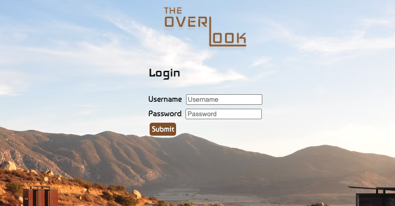

# Overlook Hotel

 Overlook Hotel is a booking application allowing users to login to the hotel's website, view their bookings, view rooms available upon selecting a date, and book a new reservation all in one user interface.

This was the final project of the second module of the front-end Engineering program at Turing School of Software and Design. The spec for this project can be found [here](https://frontend.turing.edu/projects/overlook.html).

## How to View Overlook in Action

### Set Up Instructions
1. Clone this repo to your local machine
2. `cd ` into `overlook`
3. Then, run NPM install from your command line: `npm install `
    - Do not run `npm audit fix`
4. After you run npm install inside of your copy of this repo, run:
`npm start`
5. Find the line that says `Project is running at http://localhost:8080/` Copy and paste that URL into your browser into your browser. You should have the application set up and ready to use!
6. Make sure that you type `Control + C` in your terminal when you are done using the application. This ensure the server will stop running before your close your Terminal.

## Booking with Overlook

- Start by logging in using the username `customer50` and password `overlook2021`
- Once logged in, navigate to the middle section titled Your Reservations to view all of your reservations, most recent bookings at the top.
- If you'd like to book another room, select a date in the Book Your Next Stay box to the left and click `Find Available Rooms`

- Browse through the available rooms and filter as needed. Once you find a desired room, click on it to view booking details.
- If all looks great, click `Confirm Booking` to purchase. This reservation will populate at the top of your reservation list and add to your total cost.

### Technologies Used

- JavaScript
- CSS
- HTML
- Mocha & Chai
- Locally Hosted APIs

## Acknowledgements
- Project Manager/Turing Instructor **Kayla Gordon**
- Peer Reviewer  **Jordan Sullivan**
- Mentor **Kelsie Besinger Yeh**
- Login Image from Upsplash by: Manuel Moreno

### Author

[Angele Williams](https://github.com/angelewilliams)
